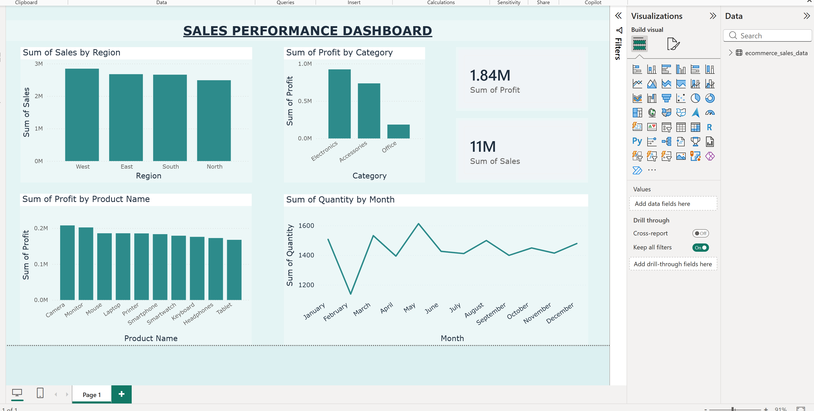

# 📊 Sales Performance Dashboard | Power BI

An interactive **Sales Performance Dashboard** developed using **Microsoft Power BI** to analyze sales performance, revenue, profit, customer behavior, and business trends through dynamic visualizations and KPI cards.

---

## 📌 Project Overview

The **Sales Performance Dashboard** transforms raw sales data into meaningful insights, helping businesses monitor key performance indicators (KPIs), identify growth opportunities, and make data-driven decisions.

This dashboard provides an intuitive interface for analyzing sales performance across different regions, products, customers, and time periods.

---

## 🚀 Key Features

- 📈 Sales Performance Analysis
- 💰 Revenue & Profit Analysis
- 🛍 Product Performance
- 🌍 Region-wise Sales Analysis
- 👥 Customer Insights
- 📅 Monthly & Yearly Sales Trends
- 🎯 KPI Cards
- 🎛 Interactive Filters & Slicers

---

## 🛠️ Tools & Technologies

- Microsoft Power BI
- Microsoft Excel
- Power Query
- DAX (Data Analysis Expressions)

---

## 📷 Dashboard Preview

> Upload a screenshot of your dashboard in this repository and rename it to **Dashboard.png**.

```markdown

```

---

## 📂 Repository Structure

```text
Sales-Performance-Dashboard/
│
├── Sales Performance Dashboard.pbix
├── Dataset.xlsx
├── Dashboard.png
├── README.md
└── LICENSE
```

---

## 📊 Dashboard Insights

The dashboard provides insights into:

- Total Sales
- Total Revenue
- Total Profit
- Total Orders
- Sales by Region
- Sales by Product Category
- Customer-wise Sales
- Monthly Sales Trend
- Top Performing Products
- Business KPIs

---

## 💡 Business Benefits

- Monitor overall sales performance
- Track revenue and profit trends
- Identify top-performing products
- Analyze customer purchasing behavior
- Compare regional performance
- Support strategic business decisions

---

## ▶️ How to Use

1. Clone or download this repository.
2. Open **Sales Performance Dashboard.pbix** using **Microsoft Power BI Desktop**.
3. Refresh the dataset if required.
4. Explore the dashboard using interactive filters and slicers.

---

## 💼 Skills Demonstrated

- Data Visualization
- Dashboard Development
- Business Intelligence
- Data Cleaning
- Data Transformation
- Power Query
- DAX
- KPI Reporting
- Analytical Thinking

---

## 📧 Connect With Me

**Jitendra Kumar Sharma**

🎓 B.Tech (Artificial Intelligence & Data Science)

📊 Aspiring Data Analyst | Power BI Developer | AI & Data Science Enthusiast

- 💻 GitHub: https://github.com/jitendra-sharmas
- 💼 LinkedIn: https://www.linkedin.com/in/jitendra-sharmas/

---

## ⭐ Support

If you found this project useful, please consider giving this repository a **⭐ Star**.

Thank you for visiting my project!

---

## 📄 License

This project is licensed under the **MIT License**.
